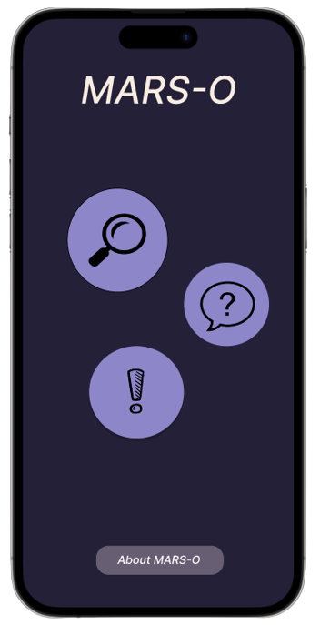
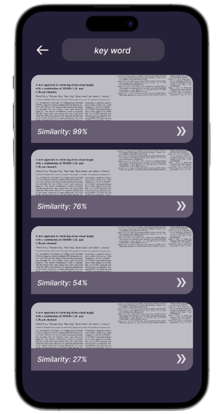
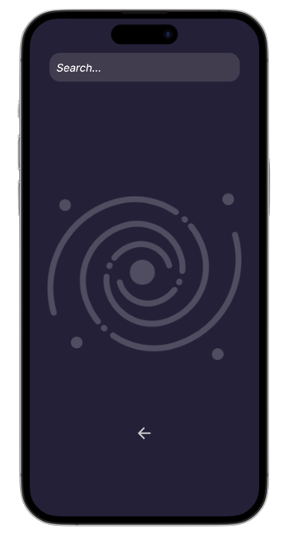
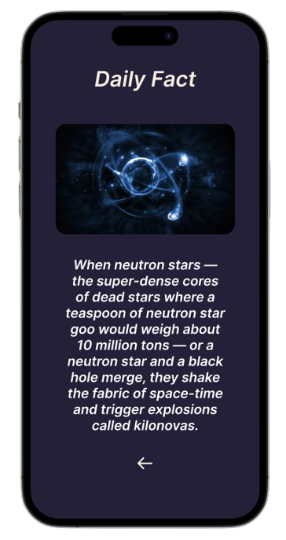
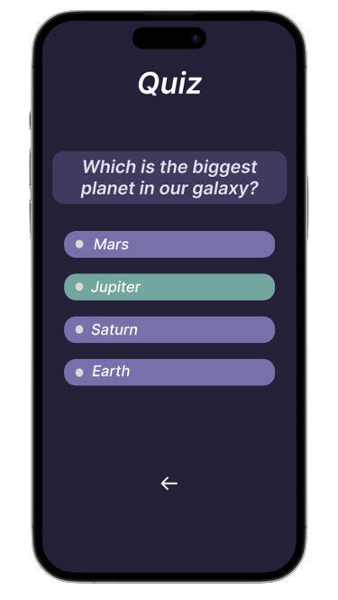

# Project Name
> MARS-O is a software/API that reads, analyzes and categorizes any documents so that they can be easily and quickly found later. We also provide a mobile app for easy access to the API and , where you can enrich and use your space knowledge with our “Daily fact” & “Daily Quiz”.
> Live demo [_here_](https://www.example.com). <!-- If you have the project hosted somewhere, include the link here. -->

## Table of Contents
* [General Info](#general-information)
* [Technologies Used](#technologies-used)
* [Features](#features)
* [Screenshots](#screenshots)
* [Setup](#setup)
* [Usage](#usage)
* [Project Status](#project-status)
* [Room for Improvement](#room-for-improvement)
* [Acknowledgements](#acknowledgements)
* [Contact](#contact)
<!-- * [License](#license) -->

## General Information
- Mars-O is an easy to use ios and android app.
- Nasa has a big repository of files which prove difficult to find specific documents to find. Here comes Mars-O.
- Marso-o scans and creates a short summary of every document in given repository, which then is used to compare to an input string and find a ratio. Documents are sorted by ratio (and for easy use displayed on our app) 

## Technologies Used
- Flask - version 2.1.2
- nltk - version 3.7
- opencv_python - version 4.5.1.48
- pdf2image - version 1.16.0
- pdfminer - version 20191125
- spacy - version 3.4.1
- transformers - 4.22.2
- react-native - 0.70
- sqlite - version 3.34

## Features
List the ready features here:
- Api access to categorized documents
- App for easy use on mobile
- Random facts about space to enrichen your knowledge

## Screenshots

<!-- If you have screenshots you'd like to share, include them here. -->

## Setup
What are the project requirements/dependencies? Where are they listed? A requirements.txt or a Pipfile.lock file perhaps? Where is it located?

Proceed to describe how to install / setup one's local environment / get started with the project.

## Usage
How does one go about using it?
Provide various use cases and code examples here.

`write-your-code-here`

## Project Status
Project is: _in progress_ / _complete_ / _no longer being worked on_. If you are no longer working on it, provide reasons why.

## Room for Improvement
Include areas you believe need improvement / could be improved. Also add TODOs for future development.

Room for improvement:
- Improvement to be done 1
- Improvement to be done 2

To do:
- Feature to be added 1
- Feature to be added 2

## Acknowledgements
Give credit here.
- This project was inspired by...
- This project was based on [this tutorial](https://www.example.com).
- Many thanks to...

## Contact
Created by [@flynerdpl](https://www.flynerd.pl/) - feel free to contact me!

<!-- Optional -->
<!-- ## License -->
<!-- This project is open source and available under the [... License](). -->

<!-- You don't have to include all sections - just the one's relevant to your project -->
